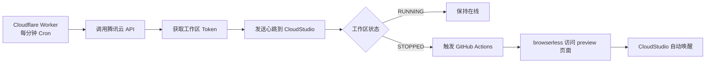

# CloudStudio 24h 保活系统

> 腾讯 CloudStudio 免费工作区 24 小时保活方案：Cloudflare Worker 定时心跳 + GitHub Actions browserless 自动唤醒。

[](./DEPLOYMENT_GUIDE.md)
[](./LICENSE)

## ✨ 核心特性

- 🔄 **全自动保活** — Worker 每分钟心跳，检测到关机立即唤醒
- 💰 **零成本运行** — Cloudflare Worker 免费额度 + GitHub Actions 免费时长
- 🌐 **自定义域名** — 绑定自己的域名，直接访问 IDE 并复用登录态
- 🔢 **多工作区支持** — 可同时保活多个 CloudStudio 工作区
- 📊 **实时监控** — 状态查询 API + Prometheus 指标导出

---

## 🚀 快速开始

### 方式一：一键部署（推荐）

1. **Fork 本仓库**
2. **配置密钥** — 参考 [完整部署指南](./DEPLOYMENT_GUIDE.md)
3. **触发部署** — Actions → `Deploy Worker` → `Run workflow`
4. **验证部署** — 访问 `https://your-domain.com/status`

详细步骤请查看：**[📖 完整部署指南](./DEPLOYMENT_GUIDE.md)**

### 方式二：快速配置清单

需要准备：

| 配置项 | 说明 | 获取地址 |
|--------|------|---------|
| 腾讯云 SecretId/Key | API 访问凭据 | [腾讯云控制台](https://console.cloud.tencent.com/cam/capi) |
| Cloudflare API Key | Worker 部署凭据 | [Cloudflare Profile](https://dash.cloudflare.com/profile/api-tokens) |
| 工作区 ID (spaceKey) | 要保活的工作区标识 | [CloudStudio 控制台](https://cloudstudio.net/dashboard) |
| 自定义域名 | Cloudflare 托管的域名 | [Cloudflare DNS](https://dash.cloudflare.com/) |

配置到 GitHub Secrets 和 Variables 后，运行部署即可。

---

## 🏗️ 工作原理



**核心流程：**

1. **定时心跳** — Cloudflare Worker Cron 每分钟执行
2. **获取凭据** — 调用腾讯云 API 获取工作区 token
3. **发送心跳** — 向 CloudStudio 发送保活请求
4. **状态检测** — 检测工作区是否关机
5. **自动唤醒** — 关机时触发 GitHub Actions，browserless 访问 preview 页面唤醒

---

## 📁 项目结构

```
cloudstudio-keepalive/
├── worker/
│   ├── index.js              # Worker 主逻辑（心跳 + 状态检测）
│   └── wrangler.toml         # Worker 配置（Cron 触发器）
├── .github/workflows/
│   ├── deploy.yml            # Worker 部署流程
│   └── preview.yml           # 自动唤醒流程（browserless）
├── scripts/
│   └── deploy-worker.sh      # 部署脚本（自动配置路由）
├── DEPLOYMENT.md             # 完整部署指南
├── setup-secrets.md          # GitHub Secrets/Variables 配置指南
└── README.md
```

---

## 🔌 API 端点

### `GET /status` — 查询工作区状态

```bash
curl https://your-domain.com/status
```

**响应示例：**

```json
{
  "workspaces": [
    {
      "spaceKey": "abc123",
      "name": "My Workspace",
      "status": "RUNNING",
      "lastHeartbeat": "2026-09-12T10:30:00Z"
    }
  ]
}
```

### `GET /metrics` — Prometheus 指标

```bash
curl https://your-domain.com/metrics
```

可接入 Grafana / Prometheus 进行监控。

### `GET /` — 直接访问 IDE

访问自定义域名根路径，自动跳转到 CloudStudio IDE 并保持登录态。

---

## ⚙️ 高级配置

### 修改心跳间隔

编辑 `worker/wrangler.toml`：

```toml
[triggers]
crons = ["*/5 * * * *"]  # 改为每 5 分钟心跳
```

然后重新部署：

```bash
gh workflow run deploy.yml
```

### 多工作区支持

在 GitHub Variables 中配置 `SPACE_KEYS`：

```
workspace1,workspace2,workspace3
```

Worker 会依次为每个工作区发送心跳。

### 自定义唤醒策略

编辑 `.github/workflows/preview.yml`，调整 browserless 参数或超时时间。

---

## 🛠️ 故障排查

### 问题：访问域名无法解析

**原因：** DNS 配置错误或未开启代理

**解决方案：**
1. 登录 Cloudflare Dashboard → DNS → Records
2. 确认已添加 A 记录指向 `192.0.2.1`
3. **确认代理状态为 Proxied（橙色云朵图标）✅**
4. 等待 1-2 分钟让 DNS 传播

### 问题：Worker 部署失败

**常见错误及解决方案：**

| 错误信息 | 解决方案 |
|---------|---------|
| `Authentication error` | 检查 `CF_AUTH_EMAIL` 和 `CF_GLOBAL_API_KEY` |
| `Zone not found` | 确认域名已托管在 Cloudflare |
| `Route not created` | 确认 DNS 记录已开启 Proxy（橙色云朵） |

### 问题：心跳失败，工作区未保活

**原因：** API 凭据错误或工作区 ID 不匹配

**解决方案：**
1. 确认 `TENCENT_SECRET_ID` 和 `TENCENT_SECRET_KEY` 正确
2. 确认 `SPACE_KEYS` 是你账号下的工作区
3. 访问 [腾讯云控制台](https://console.cloud.tencent.com/cloudstudio) 确认工作区状态
4. 查看 Cloudflare Worker 日志（Dashboard → Workers → Logs）

更多排查步骤请查看：**[部署指南 - 故障排查](./DEPLOYMENT_GUIDE.md#故障排查)**

---

## 📖 文档索引

- **[完整部署指南](./DEPLOYMENT_GUIDE.md)** — 从零开始的详细部署步骤
- **[Secrets 配置指南](./setup-secrets.md)** — GitHub Secrets/Variables 配置说明

---

## 💡 常见问题

<details>
<summary><strong>Q: 这会消耗多少流量？</strong></summary>

A: 心跳请求极小（<1KB/次），Cloudflare Worker 每天免费 100,000 次请求，完全够用。
</details>

<details>
<summary><strong>Q: 工作区会自动关机吗？</strong></summary>

A: 配置完成后，Worker 会每分钟发送心跳，工作区会一直保持 RUNNING 状态。即使意外关机，Actions 会自动唤醒。
</details>

<details>
<summary><strong>Q: 需要一直开着浏览器吗？</strong></summary>

A: 不需要。所有操作都在云端自动执行（Worker + Actions），本地无需任何进程。
</details>

<details>
<summary><strong>Q: 支持多个工作区吗？</strong></summary>

A: 支持。在 `SPACE_KEYS` 中用逗号分隔多个工作区 ID 即可。
</details>

<details>
<summary><strong>Q: 腾讯云会收费吗？</strong></summary>

A: CloudStudio 免费版工作空间完全免费，API 调用在免费额度内，无需付费。
</details>

---

## 📄 许可证

MIT License

---

## 🔗 相关链接

- [腾讯云 API 密钥管理](https://console.cloud.tencent.com/cam/capi)
- [Cloudflare Dashboard](https://dash.cloudflare.com/)
- [CloudStudio 控制台](https://cloudstudio.net/dashboard)
- [GitHub Actions 文档](https://docs.github.com/en/actions)

---

## 🤝 贡献

欢迎提交 Issue 和 Pull Request！

如有问题或建议，请访问：https://github.com/Shitsuki4/cloudstudio-keepalive/issues
